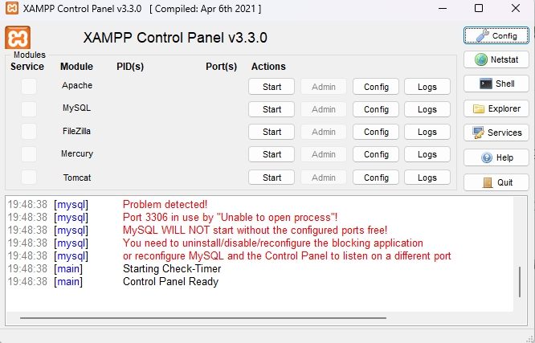
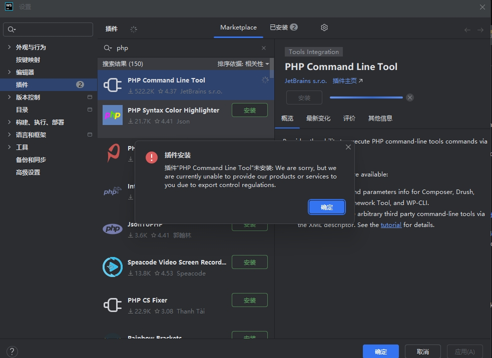
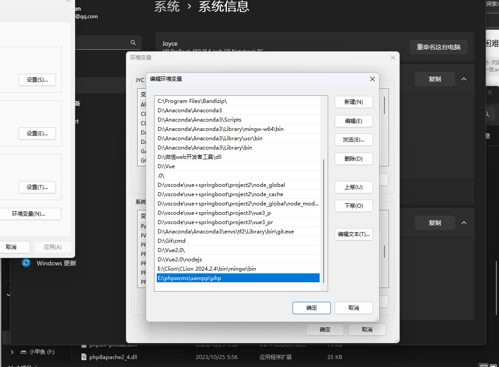

# 1. 简介

phpwcms是一个灵活、快速、强大且对客户和开发者友好的基于Web的内容管理系统（CMS）框架，运行在PHP和MySQL/MariaDB上。它由Oliver Georgi创建并维护。

- **官网**：[phpwcms.org](https://phpwcms.org/) 或 [phpwcms支持论坛](https://phpwcms.org/forum)
- **社区文档**：社区驱动的HowTo Wiki（快照）
- **问题解答**：大多数问题已在phpwcms支持论坛中得到解答。

### **快速开始**

- **稳定版本**：可以通过克隆仓库 `git clone git://github.com/slackero/phpwcms.git` 或下载归档文件来使用。
- **开发版本**：使用 `git clone -b v1.10-dev git://github.com/slackero/phpwcms.git` 或下载开发版本的归档文件。如果下载了归档文件，请解压并将其复制到Web文档根目录或子文件夹中，然后通过浏览器访问相关URL并按照安装说明操作。

### **升级**

- 在升级到v1.10+之前，请先更新到最新的v1.9.x版本。
- **备份**：升级前请务必备份数据库和文件。

### **服务器系统要求**

- **phpwcms版本1.10.8**：需要支持PHP 8.2或更高版本的Web服务器，以及MySQL/MariaDB数据库（最低版本5.6+或等效版本）。

### **已知问题**

- 由于项目历史原因，数据库可能存在一些问题。MySQL在过去几年中更改了与时间和日期相关的默认值。建议检查相关配置值以更兼容的方式连接到数据库。MySQL Strict模式不是一个好的选择。

### **Bug追踪**

- 如果发现Bug，请在GitHub上创建符合necolas指南的Issue。

### **分享**

- phpwcms已不再活跃于社交媒体。请使用phpwcms支持论坛或GitHub分享您的想法。

### **创建者**

- **Oliver Georgi**：[GitHub主页](https://github.com/slackero) | [个人网站](https://webverbund.de/)

### **版权和许可**

- **版权**：2002-2025年，Oliver Georgi
- **许可**：根据GNU通用公共许可证第2版（GPLv2）授权。您可以在[LICENSE文件](https://github.com/slackero/phpwcms/blob/master/LICENSE)或[GNU许可证官网](https://opensource.org/licenses/GPL-2.0)查看许可证详情。
- **自由软件**：您可以自由分发和/或修改此软件，但不提供任何形式的保证，包括适销性或特定用途的适用性保证。详情请参阅GNU通用公共许可证。

<!-- by 施国达 -->

# 2. 项目部署

要运行 **phpwcms** 项目我当然离不开配置环境啦！接下来就详细地讲解一下该如何配置环境吧！

**因为WebStorm是我们常用的前端软件，所以我们以WebStorm为基础去配置环境**

## ~~2.1 安装本地开发环境~~

### ~~2.1.1安装Web服务器~~

WebStorm 是一个强大的 PHP 开发工具，但它本身不包含 **Web 服务器**或数据库，因此我们需要配置本地开发环境来运行项目。

- 首先我们可以进入到这个网页：[XAMPP Installers and Downloads for Apache Friends](https://www.apachefriends.org/zh_cn/index.html)

去下载XAMPP，它包含了Apache、 Mysql、 PHP是一个非常值得推荐的开发环境

我们下载的**版本是8.2.12**版本（推荐8.2版本以上的）

- 下载安装web Storm

- 下载mysql（XAMPP自带mysql）

## ~~2.2 配置Web Storm~~

欸？这里发现了一个问题！我们的webstorm不支持下载

~~好的那么一切重来哈哈哈哈哈哈哈哈哈哈~~

##  2.1 安装本地开发环境

现在是基于vscode版本

- 配置PHP(环境变量)

~~~bash
php -v

PHP 8.2.12 (cli) (built: Oct 24 2023 21:15:15) (ZTS Visual C++ 2019 x64)
Copyright (c) The PHP Group
Zend Engine v4.2.12, Copyright (c) Zend Technologies
~~~

**此时命令行已经显示出版本号说明PHP环境ok**

- 配置mysql（网上自己下载去~）

~~~bash
(base) PS E:\phpwcms\phpwcms-master\phpwcms-master> MySQL -u root -p
Enter password: ******
Welcome to the MySQL monitor.  Commands end with ; or \g.
Your MySQL connection id is 10
Server version: 8.0.19 MySQL Community Server - GPL

Copyright (c) 2000, 2020, Oracle and/or its affiliates. All rights reserved.

Oracle is a registered trademark of Oracle Corporation and/or its
affiliates. Other names may be trademarks of their respective
owners.

Type 'help;' or '\h' for help. Type '\c' to clear the current input statement.
~~~

**说明mysql环境也没有问题可以正常登录**

- **安装 Composer**：

~~~bash
php -r "copy('https://getcomposer.org/installer', 'composer-setup.php');"
php composer-setup.php
php -r "unlink('composer-setup.php');"
~~~

输入以下命令（自己操作时注意路径，把文件放入到全局环境中）

~~~bash
mv composer.phar E:\phpwcms\xampp\php\composer
~~~

运行依赖

~~~bash
composer install
~~~

如果不行的话就是Composer安装有问题（一般都是因为**网络太差了**才这样，可以多试几次）

也可以重新安装

~~~bash
两张链接
首选
php -r "copy('https://getcomposer.org/installer', 'composer-setup.php');"
备选
php -r "copy('https://install.phpcomposer.com/installer', 'composer-setup.php');"
~~~

下载完可以输入以验证

~~~bash
php -r "if (hash_file('sha384', 'composer-setup.php') === 'your_correct_hash_value') { echo 'Installer verified'; } else { echo 'Installer corrupt'; unlink('composer-setup.php'); } echo PHP_EOL;"
~~~

运行

~~~bash
php composer-setup.php --install-dir=bin --filename=composer
~~~

验证安装

~~~bash
php bin\composer --version
~~~

**如果还是不行请检查你的项目是否放在xampp->htdocs中**

~~vscode麻烦的地方在于好多地方配置完都需要重新打开~~

<!-- by 叶倬禛 -->

