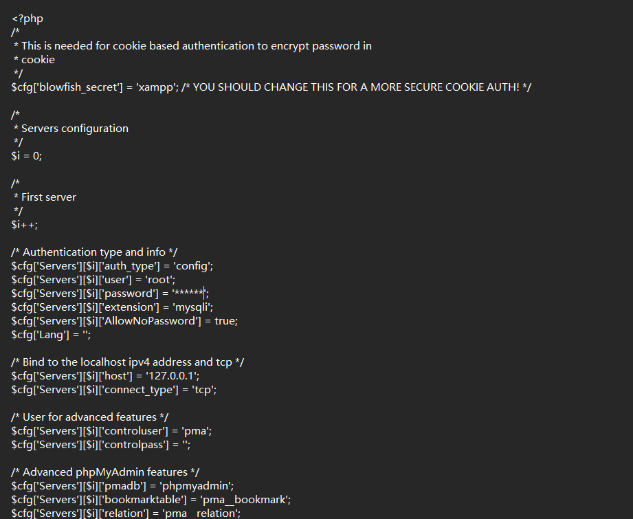
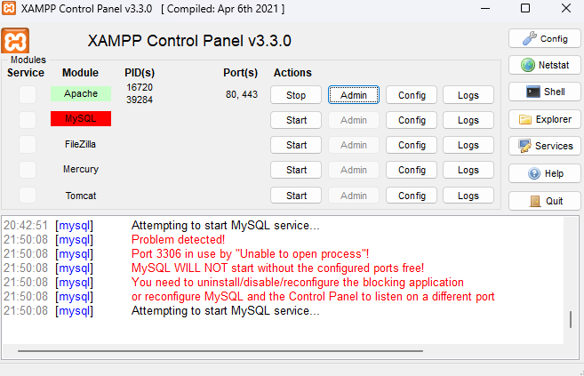
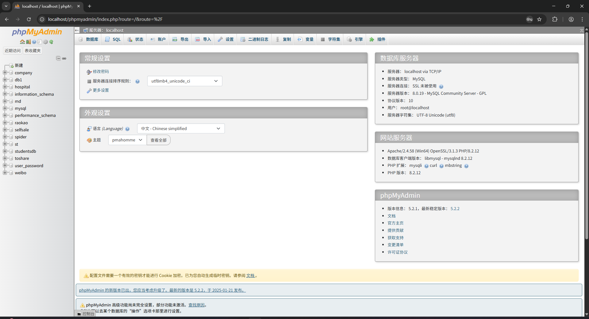

# 1. 简介
phpwcms是一个灵活、快速、强大且对客户和开发者友好的基于Web的内容管理系统（CMS）框架，运行在PHP和MySQL/MariaDB上。它由Oliver Georgi创建并维护。

- **官网**：[phpwcms.org](https://phpwcms.org/) 或 [phpwcms支持论坛](https://phpwcms.org/forum)
- **社区文档**：社区驱动的HowTo Wiki（快照）
- **问题解答**：大多数问题已在phpwcms支持论坛中得到解答。

### **快速开始**

- **稳定版本**：可以通过克隆仓库 `git clone git://github.com/slackero/phpwcms.git` 或下载归档文件来使用。
- **开发版本**：使用 `git clone -b v1.10-dev git://github.com/slackero/phpwcms.git` 或下载开发版本的归档文件。如果下载了归档文件，请解压并将其复制到Web文档根目录或子文件夹中，然后通过浏览器访问相关URL并按照安装说明操作。

### **升级**

- 在升级到v1.10+之前，请先更新到最新的v1.9.x版本。
- **备份**：升级前请务必备份数据库和文件。

### **服务器系统要求**

- **phpwcms版本1.10.8**：需要支持PHP 8.2或更高版本的Web服务器，以及MySQL/MariaDB数据库（最低版本5.6+或等效版本）。

### **已知问题**

- 由于项目历史原因，数据库可能存在一些问题。MySQL在过去几年中更改了与时间和日期相关的默认值。建议检查相关配置值以更兼容的方式连接到数据库。MySQL Strict模式不是一个好的选择。

### **Bug追踪**

- 如果发现Bug，请在GitHub上创建符合necolas指南的Issue。

### **分享**

- phpwcms已不再活跃于社交媒体。请使用phpwcms支持论坛或GitHub分享您的想法。

### **创建者**

- **Oliver Georgi**：[GitHub主页](https://github.com/slackero) | [个人网站](https://webverbund.de/)

### **版权和许可**

- **版权**：2002-2025年，Oliver Georgi
- **许可**：根据GNU通用公共许可证第2版（GPLv2）授权。您可以在[LICENSE文件](https://github.com/slackero/phpwcms/blob/master/LICENSE)或[GNU许可证官网](https://opensource.org/licenses/GPL-2.0)查看许可证详情。
- **自由软件**：您可以自由分发和/或修改此软件，但不提供任何形式的保证，包括适销性或特定用途的适用性保证。详情请参阅GNU通用公共许可证。

<!-- by 施国达 -->

### **GNU通用公共许可证**
- **第2版，1991年6月**
版权所有 (C) 1989，1991 自由软件基金会 51 Franklin Street, Fifth Floor, Boston, MA 02110-1301, USA 允许任何人复制和分发本许可证文档的原文副本，但不允许对其进行修改。
- **前言**
大多数软件的许可证旨在剥夺您共享和修改软件的自由。相比之下，GNU通用公共许可证意在保障您共享和修改自由软件的自由——确保软件对所有用户都是自由的。本通用公共许可证适用于自由软件基金会的大部分软件以及任何作者承诺使用它的其他程序（自由软件基金会的某些软件则受GNU库通用公共许可证的保护）。您也可以将其应用于您的程序。 
当我们谈论自由软件时，我们指的是自由，而非价格。我们的通用公共许可证旨在确保您拥有分发自由软件副本的自由（如果您愿意，可以为此服务收费）；确保您能收到源代码或者在需要时可以获取；确保您能修改软件或在新的自由程序中使用其中的部分；并确保您知道您可以做这些事情。 
为保护您的权利，我们需要做出限制，禁止任何人剥夺您的这些权利或要求您放弃这些权利。如果您分发软件副本或对其进行修改，这些限制就转化为您需要承担的责任。 
例如，如果您分发此类程序的副本，无论是免费还是收费，您必须给予接收者您所拥有的全部权利。您必须确保他们也能收到或获取源代码。而且您必须向他们展示这些条款，使他们知道自己的权利。 
我们通过两个步骤来保护您的权利：(1) 对软件进行版权保护；(2) 向您提供本许可证，授予您复制、分发和/或修改软件的法律许可。 
同时，为了保护每位作者和我们自己，我们希望确保每个人都理解这一点：自由软件不提供任何担保。如果软件被他人修改并传递，我们希望接收者知道他们所得到的不是原版，因此由他人引入的任何问题不应影响原作者的声誉。 
最后，任何自由程序都持续受到软件专利的威胁。我们希望避免自由程序的再分发者个别获取专利许可，从而使程序成为专有的风险。为防止这种情况，我们已经明确表示：任何专利必须许可所有人自由使用，否则就完全不应被许可。 
以下是关于复制、分发和修改的明确条款和条件。
 
- **GNU通用公共许可证复制、分发和修改的条款和条件**
0. 本许可证适用于任何包含版权持有人声明可依据本通用公共许可证条款分发的程序或其他作品。下文中的"程序"指任何此类程序或作品，而"基于程序的作品"指程序或依据版权法的任何衍生作品：即包含程序或其部分的作品，无论是原封不动还是经过修改和/或翻译成其他语言。（在下文中，翻译包含在"修改"一词中，不受限制。）每位被许可人称为"您"。
除复制、分发和修改以外的活动不受本许可证约束；它们超出了本许可证的范围。运行程序的行为不受限制，程序的输出内容仅当其构成基于程序的作品时才受到保护（独立于程序运行而产生的结果）。这取决于程序的功能。

1. 只要您在每份副本上明显和适当地发布版权声明和免责声明；保持所有提及本许可证和任何无担保声明的通知完整；并将本许可证的副本与程序一同提供给任何其他接收者，您就可以按照您收到的原样，通过任何媒介复制和分发程序的源代码完整副本。
您可以对实际传送副本的实物行为收取费用，也可以选择提供担保保护以换取收费。

 2. 您可以修改程序的一个或多个副本或其任何部分，从而形成基于程序的作品，并按照上述第1条规定复制和分发此类修改或作品，前提是您还满足以下所有条件：

    a) 您必须使修改后的文件带有显著的通知，声明您修改了这些文件及任何修改的日期。

    b) 您必须使您分发或发布的任何作品（全部或部分包含或衍生自程序或其任何部分）整体按照本许可证条款免费许可给所有第三方。

    c) 如果修改后的程序在运行时通常以交互方式读取命令，您必须使其在以最常见的方式启动进行此类交互式使用时，打印或显示一则通告，包括适当的版权声明和无担保声明（或者声明您提供担保），并告知用户可以根据这些条件重新分发程序，以及告知用户如何查看本许可证的副本。（例外：如果程序本身是交互式的，但通常不打印此类通告，则您基于程序的作品不需要打印通告。）

这些要求适用于整体修改后的作品。如果作品的可识别部分不是衍生自程序，且可合理地被视为独立的单独作品，则当您将其作为独立作品分发时，本许可证及其条款不适用于这些部分。但当您将这些部分作为基于程序的整体作品的一部分进行分发时，整体分发必须遵循本许可证的条款，其对其他许可证持有者的许可扩展到整体，也就延伸到每一部分，无论是谁编写的。

因此，本节的意图不在于主张或争夺您对完全由您编写的作品的权利；相反，其意图是行使控制基于程序的集体或衍生作品的分发的权利。

此外，将非基于程序的其他作品与程序（或基于程序的作品）一同放置在存储或分发媒介的卷上，并不会使其他作品受到本许可证的约束。

 3. 根据上述第1和第2条的规定，您可以复制和分发程序（或基于它的作品，如第2条所述）的目标代码或可执行形式，前提是您还执行以下之一：

      a) 附带完整相应的机器可读源代码，该源代码必须按照上述第1和第2条的条款在通常用于软件交换的媒介上分发；或，
      b) 附带有效期至少三年的书面要约，向任何第三方提供完整相应的机器可读源代码，收费不超过您实际执行源码分发的物理成本，该源代码必须按照上述第1和第2条的条款在通常用于软件交换的媒介上分发；或，
      c) 附带您收到的关于分发相应源代码的要约信息。（此选项仅允许用于非商业性分发，且仅当您按照上述b项收到程序的目标代码或可执行形式并附带此类要约时。）

作品的源代码是指该作品进行修改的首选形式。对于可执行作品，完整的源代码是指其包含的所有模块的所有源代码，加上任何相关的接口定义文件，以及用于控制编译和可执行文件安装的脚本。然而，作为特例，分发的源代码不需要包括通常与可执行程序运行的操作系统的主要组件（编译器、内核等）一同分发的任何内容，除非该组件本身伴随着可执行文件。

如果通过提供从指定位置访问复制的方式来分发可执行文件或目标代码，则从同一位置提供等效的源代码访问也算作源代码的分发，即使第三方不被强制与目标代码一起复制源代码。

  4. 除非按照本许可证的明确规定，您不得复制、修改、再许可或分发程序。任何以其他方式复制、修改、再许可或分发程序的尝试均无效，并将自动终止您在本许可证下的权利。然而，已从您那里根据本许可证获得副本或权利的各方，只要他们保持完全遵守，许可证不会终止。

  5. 您不必接受本许可证，因为您尚未签署它。然而，没有其他任何东西授予您修改或分发程序或其衍生作品的许可。如果您不接受本许可证，这些行为在法律上是被禁止的。因此，通过修改或分发程序（或任何基于程序的作品），您表示接受本许可证及其所有关于复制、分发或修改程序或基于它的作品的条款和条件。

  6. 每当您重新分发程序（或任何基于程序的作品）时，接收者自动从原始许可人处获得按照这些条款和条件复制、分发或修改程序的许可证。您不得对接收者行使本许可证所授予权利施加任何进一步限制。您不负责强制第三方遵守本许可证。

  7. 如果由于法院判决或专利侵权指控或任何其他原因（不限于专利问题）而导致施加条件（无论是通过法院命令、协议或其他方式）违反本许可证的条件，这些条件不能使您免除本许可证的条件。如果您无法在满足本许可证义务的同时满足任何其他相关义务进行分发，那么作为后果，您可能根本不能分发程序。例如，如果某专利许可不允许所有直接或间接通过您接收副本的人免费重新分发该程序，那么唯一能同时满足该专利许可和本许可证的方法就是完全不分发程序。

如果本节的任何部分在特定情况下被认定为无效或不可执行，本节的其余部分应当适用，整个部分在其他情况下仍然有效。

本节的目的不在于诱导您侵犯任何专利或其他财产权利主张，或对此类主张的有效性提出异议；本节唯一目的是保护自由软件分发系统的完整性，该系统通过公共许可实践实施。许多人已经通过该系统为广泛分发的软件做出了慷慨的贡献，依赖该系统的一致应用；由作者/捐赠者决定是否愿意通过任何其他系统分发软件，被许可人不能强加此选择。

本节旨在彻底阐明本许可证其余部分的必然后果。

  8. 如果由于专利或受版权保护的接口而限制程序在某些国家的分发和/或使用，则将程序置于本许可证下的原始版权持有人可以添加明确的地域分布限制，排除这些国家，使分发仅限于未被排除的国家之内或之间。在这种情况下，本许可证会将该限制如同写入本许可证正文一样纳入其中。

  9. 自由软件基金会可能会不时发布通用公共许可证的修订版和/或新版本。这些新版本在精神上将类似于当前版本，但在细节上可能会有所不同，以解决新的问题或关切。

每个版本都有一个区别性的版本号。如果程序指定了适用于它的本许可证版本号以及"任何更新版本"，您可以选择遵循该版本或自由软件基金会发布的任何更新版本的条款和条件。如果程序未指定许可证版本号，您可以选择自由软件基金会发布的任何版本。

  10. 如果您希望将程序的部分纳入其他具有不同分发条件的自由程序，请致信作者征求许可。对于由自由软件基金会享有版权的软件，请致信自由软件基金会；我们有时会为此做出例外。我们的决定将由保持我们自由软件的所有衍生品的自由状态和普遍促进软件共享与重用这两个目标来指导。
 
- **无担保条款**
11. 由于程序是免费许可的，在适用法律允许的范围内，对程序不提供任何担保。除非另有书面说明，版权持有人和/或其他方按"原样"提供程序，不提供任何形式的担保，无论是明示的还是暗示的，包括但不限于对适销性和特定用途适用性的暗示担保。程序的质量和性能的全部风险均由您承担。如果程序被证明有缺陷，您将承担所有必要的服务、修复或纠正的费用。

  12. 除非适用法律要求或书面同意，任何版权持有人或按照上述许可可能修改和/或重新分发程序的任何其他方，均不对您承担损害赔偿责任，包括因使用或无法使用程序而产生的任何一般性、特殊性、偶然性或后果性损害（包括但不限于数据丢失或数据不准确或您或第三方遭受的损失或程序无法与任何其他程序一起运行），即使此类持有人或其他方已被告知此类损害的可能性。
 
- **条款和条件结束**
<!-- by 周阳 -->

# 2. 项目部署

要运行 **phpwcms** 项目我当然离不开配置环境啦！接下来就详细地讲解一下该如何配置环境吧！

**因为WebStorm是我们常用的前端软件，所以我们以WebStorm为基础去配置环境**

## ~~2.1 安装本地开发环境~~

### ~~2.1.1安装Web服务器~~

WebStorm 是一个强大的 PHP 开发工具，但它本身不包含 **Web 服务器**或数据库，因此我们需要配置本地开发环境来运行项目。

- 首先我们可以进入到这个网页：[XAMPP Installers and Downloads for Apache Friends](https://www.apachefriends.org/zh_cn/index.html)

去下载XAMPP，它包含了Apache、 Mysql、 PHP是一个非常值得推荐的开发环境

我们下载的**版本是8.2.12**版本（推荐8.2版本以上的）

- 下载安装web Storm

- 下载mysql（XAMPP自带mysql）

## ~~2.2 配置Web Storm~~

欸？这里发现了一个问题！我们的webstorm不支持下载

~~好的那么一切重来哈哈哈哈哈哈哈哈哈哈~~

##  2.1 安装本地开发环境

现在是基于vscode版本

- 配置PHP(环境变量)

~~~bash
php -v

PHP 8.2.12 (cli) (built: Oct 24 2023 21:15:15) (ZTS Visual C++ 2019 x64)
Copyright (c) The PHP Group
Zend Engine v4.2.12, Copyright (c) Zend Technologies
~~~

**此时命令行已经显示出版本号说明PHP环境ok**

- 配置mysql（网上自己下载去~）

~~~bash
(base) PS E:\phpwcms\phpwcms-master\phpwcms-master> MySQL -u root -p
Enter password: ******
Welcome to the MySQL monitor.  Commands end with ; or \g.
Your MySQL connection id is 10
Server version: 8.0.19 MySQL Community Server - GPL

Copyright (c) 2000, 2020, Oracle and/or its affiliates. All rights reserved.

Oracle is a registered trademark of Oracle Corporation and/or its
affiliates. Other names may be trademarks of their respective
owners.

Type 'help;' or '\h' for help. Type '\c' to clear the current input statement.
~~~

**说明mysql环境也没有问题可以正常登录**

- **安装 Composer**：

~~~bash
php -r "copy('https://getcomposer.org/installer', 'composer-setup.php');"
php composer-setup.php
php -r "unlink('composer-setup.php');"
~~~

输入以下命令（自己操作时注意路径，把文件放入到全局环境中）

~~~bash
mv composer.phar E:\phpwcms\xampp\php\composer
~~~

运行依赖

~~~bash
composer install
~~~

如果不行的话就是Composer安装有问题（一般都是因为**网络太差了**才这样，可以多试几次）

也可以重新安装

~~~bash
两张链接
首选
php -r "copy('https://getcomposer.org/installer', 'composer-setup.php');"
备选
php -r "copy('https://install.phpcomposer.com/installer', 'composer-setup.php');"
~~~

下载完可以输入以验证

~~~bash
php -r "if (hash_file('sha384', 'composer-setup.php') === 'your_correct_hash_value') { echo 'Installer verified'; } else { echo 'Installer corrupt'; unlink('composer-setup.php'); } echo PHP_EOL;"
~~~

运行

~~~bash
php composer-setup.php --install-dir=bin --filename=composer
~~~

验证安装

~~~bash
php bin\composer --version
~~~

**如果还是不行请检查你的项目是否放在xampp->htdocs中**

~~vscode麻烦的地方在于好多地方配置完都需要重新打开~~

<!-- by 叶倬禛 -->

## 2.2 配置数据库

进入到xampp->phpmyadmin->config.inc.php中，配置你的数据库信息

配置完成之后点击XAMPP中的admin

就能进入到登录页面，输入账号密码就可以进来了

这样就入到数据库里了~~~

- 检查MySql配置文件

进入到XAMPP->mysql->bin->my.ini中检查以下配置

~~~ini
[mysqld]
bind-address = 127.0.0.1
~~~

## 2.3 在vscode中打开项目

推荐安装以下 VSCode 扩展：

- **PHP Intelephense**：提供代码提示和智能感知。
- **PHP Debug**：用于调试 PHP 代码。
- **Live Server**：用于实时预览网页。

## 2.4  **运行项目**

1. **通过 XAMPP 访问项目**： 打开浏览器，访问 `http://localhost/phpwcms`。
   - 如果一切配置正确，你应该能看到 phpwcms 的安装向导页面。
   - 按照安装向导的提示完成安装，包括数据库配置、管理员账户创建等。
2. **使用 VSCode 的 Live Server**：
   - 在 VSCode 中，右键点击项目中的 `index.php` 文件，选择“Open with Live Server”。
   - Live Server 会自动启动一个本地服务器，并在浏览器中打开项目。

<!-- by 王梓宇 -->

# 3. 调试项目

如果需要**调试PHP代码**，可以配置Xdebug:

- 安装Xdebug

  编辑XAMPP->php->php.ini文件，添加以下配置

~~~ini
[Xdebug]
zend_extension="C:\xampp\php\ext\php_xdebug.dll"
xdebug.mode=debug
xdebug.start_with_request=yes
xdebug.client_host=127.0.0.1
xdebug.client_port=9003
~~~

（**配置后**一定要记得重启XAMPP的Apache模块）

- **配置VSC偶的的调试环境**

~~~txt
在 VSCode 中，点击左侧的“运行和调试”图标。
点击“创建 launch.json 文件”，选择“PHP”作为调试环境。
启动调试，VSCode 会自动连接到 Xdebug。
~~~

# 4. 总结与补充

1. **数据库连接问题**：

   ​		我们小组在初期连接数据库的时候发现数据库总是连不上，以为是本地的数据库冲突了。其实不是这个原因。

   ​		而是我们没有进入到正确的地方去配置环境

   - **正确的方法：**找到 `config.inc.php`这个文件，进去配置你本地的数据库账号密码。

   - **确保**数据库**已创建**，并且root用户有访问权限		

2. **Apache配置问题**：

   - 一定要确保某盘:/xampp/hodocs/phpwcms文件夹中存在index.php或者其他入口文件。
   - 检查httpd.conf文件，确保`DocumentRoot` 和 `Directory` 配置正确。

3.  **权限问题**：

   - 确保 XAMPP 的 Apache 服务有权限访问项目文件夹和文件。

4. **URL 路径问题**：

   - 确保访问的 URL 路径正确。

<!-- by 李双林 -->

# 5. Contributor Covenant Code of Conduct——参与者守则行为准则

## 5.1 Our Pledge —— 我们的承诺

~~~txt
In the interest of fostering an open and welcoming environment, we as contributors and maintainers pledge to making participation in our project and our community a harassment-free experience for everyone, regardless of age, body size, disability, ethnicity, gender identity and expression, level of experience, nationality, personal appearance, race, religion, or sexual identity and orientation.
~~~

为了营造一个开放和友好的环境，作为贡献者和维护者，我们承诺让参与我们的项目和社区的每个人都能获得一个没有骚扰的体验，无论年龄、体型、残疾、种族、性别认同和表达、经验水平、国籍、个人外貌、种族、宗教或性认同和取向。

## 5.2 Our Standards —— 我们的标准

~~~txt
Examples of behavior that contributes to creating a positive environment include:

Using welcoming and inclusive language
Being respectful of differing viewpoints and experiences
Gracefully accepting constructive criticism
Focusing on what is best for the community
Showing empathy towards other community members
Examples of unacceptable behavior by participants include:

The use of sexualized language or imagery and unwelcome sexual attention or advances
Trolling, insulting/derogatory comments, and personal or political attacks
Public or private harassment
Publishing others' private information, such as a physical or electronic address, without explicit permission
Other conduct which could reasonably be considered inappropriate in a professional setting
~~~

有助于创造积极环境的行为包括：

使用欢迎和包容的语言
尊重不同的观点和经验
优雅地接受建设性的批评
专注于什么是对社区最好的
对其他社区成员表示同情
参与者不可接受的行为包括：

使用带有性色彩的语言或意象，以及不受欢迎的性关注或性挑逗
挑衅，侮辱/贬损的评论，以及个人或政治攻击
公开或私下骚扰
未经明确许可，发布他人的私人信息，如物理或电子地址
其他在专业环境中被合理认为不适当的行为

<!-- by 陆文财 -->

## 5.3 Our Responsibilities —— 我们的责任

~~~txt
Project maintainers are responsible for clarifying the standards of acceptable behavior and are expected to take appropriate and fair corrective action in response to any instances of unacceptable behavior.

Project maintainers have the right and responsibility to remove, edit, or reject comments, commits, code, wiki edits, issues, and other contributions that are not aligned to this Code of Conduct, or to ban temporarily or permanently any contributor for other behaviors that they deem inappropriate, threatening, offensive, or harmful.
~~~

项目维护者有责任澄清可接受行为的标准，并期望对任何不可接受的行为采取适当和公平的纠正措施。

项目维护者有权利和责任删除、编辑或拒绝与本行为准则不一致的评论、提交、代码、维基编辑、问题和其他贡献，或者暂时或永久禁止他们认为不适当、威胁、冒犯或有害的其他行为的任何贡献者。

## 5.4 Scope —— 范围

~~~txt
This Code of Conduct applies both within project spaces and in public spaces when an individual is representing the project or its community. Examples of representing a project or community include using an official project e-mail address, posting via an official social media account, or acting as an appointed representative at an online or offline event. Representation of a project may be further defined and clarified by project maintainers.
~~~

本行为准则既适用于项目空间，也适用于个人代表项目或社区的公共空间。代表项目或社区的例子包括使用官方项目电子邮件地址，通过官方社交媒体帐户发帖，或在在线或离线活动中担任指定代表。项目维护者可以进一步定义和澄清项目的表示。

## 5.5 Enforcement —— 执行

~~~txt
Instances of abusive, harassing, or otherwise unacceptable behavior may be reported by contacting the project team at slackero+github@gmail.com. The project team will review and investigate all complaints, and will respond in a way that it deems appropriate to the circumstances. The project team is obligated to maintain confidentiality with regard to the reporter of an incident. Further details of specific enforcement policies may be posted separately.

Project maintainers who do not follow or enforce the Code of Conduct in good faith may face temporary or permanent repercussions as determined by other members of the project's leadership.
~~~

辱骂、骚扰或其他不可接受的行为可以通过联系项目团队在slackero+github@gmail.com报告。项目团队将审查和调查所有投诉，并将以其认为适当的方式对情况作出回应。项目团队有义务对事件的报告人保密。具体执行政策的进一步细节可另行公布。

项目维护者如果不真诚地遵循或执行行为准则，可能会面临由项目领导的其他成员决定的暂时或永久的后果。

<!-- by 杨昌福 -->
